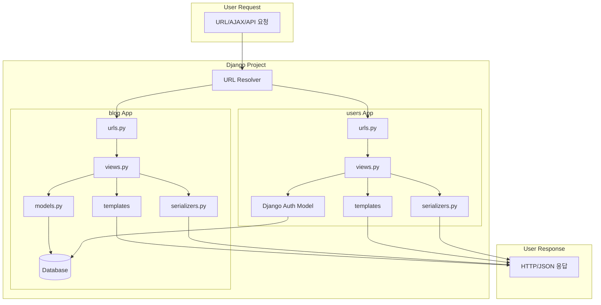

# System Patterns: Django TDD 블로그

## 1. 시스템 아키텍처 (System Architecture)

이 프로젝트는 Django 프레임워크의 기본 아키텍처인 **MVT (Model-View-Template)** 패턴과 **앱 분리 원칙(App Separation Principle)**을 따른다.

- **`blog` App**: 블로그의 핵심 기능인 게시글, 댓글, 카테고리, 태그 등 콘텐츠와 관련된 기능을 담당한다.
- **`users` App**: 사용자 인증(로그인, 로그아웃, 회원가입) 및 계정 관리 기능을 담당한다.
- 각 앱은 독립적인 Model, View, Template, URL, Form, Test 구조를 가진다.

## 2. 디자인 패턴 (Design Patterns)

### 2.1. 일반 원칙 (General Principles)

- **TDD (Test-Driven Development)**: Red-Green-Refactor 사이클을 따른다.
- **Fat Models, Thin Views**: 가능한 한 비즈니스 로직은 모델(Model)에 집중시키고, 뷰(View)는 모델과 템플릿을 연결하는 역할에 충실하도록 유지한다.
- **URL 분리**: 프로젝트의 최상위 `urls.py`는 각 앱의 `urls.py`를 `include`하는 역할만 담당하여 URL 관리를 분산시킨다.

### 2.2. 모델 패턴 (Model Patterns)

- **계층형 데이터 모델링**: `ForeignKey('self', ...)`를 사용하여 `Category`와 `Comment` 모델에서 부모-자식 관계(계층 구조)를 구현한다.
- **`choices` 상수화**: `Vote` 모델에서처럼 클래스 변수(`LIKE=1`, `DISLIKE=-1`)를 상수로 정의하여 `choices` 옵션에 사용함으로써 코드의 가독성과 유지보수성을 높인다.
- **복합 고유 제약**: `Vote` 모델의 `Meta` 클래스에서 `unique_together = ('user', 'post')`를 사용하여 사용자가 게시물당 한 번만 투표할 수 있도록 데이터베이스 수준에서 제약한다.
- **동적 User 모델 참조**: `settings.AUTH_USER_MODEL` 또는 `get_user_model()`을 사용하여 커스텀 User 모델로의 변경에 유연하게 대처한다.

### 2.3. 뷰 패턴 (View Patterns)

- **클래스 기반 뷰 (CBV)**: `ListView`, `DetailView`, `CreateView` 등 Django의 제네릭 CBV를 적극적으로 활용하여 코드의 재사용성을 높인다.
- **커스텀 권한 Mixin**: `UserPassesTestMixin`을 상속받는 `AuthorRequiredMixin`과 같은 커스텀 Mixin을 만들어 객체 수준의 복잡한 권한 로직을 재사용한다.
- **AJAX 요청 처리**: `django.views.View`를 직접 상속하고 `post` 메서드를 구현하여 AJAX 요청을 처리한다. `JsonResponse`를 사용하여 응답을 반환한다.
- **AJAX 인증 처리**: `LoginRequiredMixin`의 `handle_no_permission` 메서드를 오버라이딩하여, 인증 실패 시 리다이렉트 대신 `401 Unauthorized` 상태와 함께 JSON 에러 메시지를 반환한다.

### 2.4. 폼 패턴 (Form Patterns)

- **M2M 필드 커스텀 처리**: `ModelForm`에서 Many-to-Many 관계 필드(`tags`)를 `CharField`로 오버라이딩하고, `__init__`과 `save` 메서드를 재정의하여 쉼표로 구분된 문자열 입력을 처리한다.
- **`get_or_create` 활용**: 태그 저장 시 `Tag.objects.get_or_create()`를 사용하여 기존에 태그가 있으면 가져오고 없으면 생성하는 로직을 효율적으로 구현한다.
- **CAPTCHA 통합**: `django-simple-captcha`의 `CaptchaField`를 폼에 추가하여 스팸 방지 기능을 구현한다.

### 2.5. API (DRF) 패턴

- **제네릭 뷰 활용**: `ListCreateAPIView`, `RetrieveUpdateDestroyAPIView` 등 DRF의 제네릭 뷰를 사용하여 CRUD API 엔드포인트를 빠르게 구현한다.
- **커스텀 권한 클래스**: `BasePermission`을 상속받아 `IsOwnerOrReadOnly`와 같은 커스텀 권한 클래스를 만들어 API의 객체 수준 접근을 제어한다.
- **중첩 시리얼라이저**: `PostSerializer` 내에서 `UserSerializer`를 중첩하여 사용하여 관계된 객체의 상세 정보를 API 응답에 포함시킨다.
- **민감 정보 필터링**: `UserSerializer`에서 `fields` 속성을 명시적으로 정의하여, 비밀번호 해시 등 민감한 정보가 API를 통해 외부에 노출되지 않도록 방지한다.
- **생성 시 데이터 자동 할당**: `perform_create` 메서드를 오버라이딩하여, 요청 데이터에 포함되지 않은 `author` 같은 필드를 `request.user`를 통해 자동으로 할당한다.

## 3. 컴포넌트 관계 (Component Relationships)



## 4. 데이터베이스 스키마 (Database Schema)

```mermaid
erDiagram
    USER {
        int id PK
        varchar username
    }

    POST {
        int id PK
        varchar(200) title
        text content
        int view_count
        datetime created_at
        datetime updated_at
        int author_id FK
        int category_id FK
    }

    COMMENT {
        int id PK
        text text
        datetime created_at
        datetime updated_at
        int author_id FK
        int post_id FK
        int parent_id FK
    }

    TAG {
        int id PK
        varchar(50) name
    }

    CATEGORY {
        int id PK
        varchar(100) name
        varchar(255) slug
        int parent_id FK
    }

    VOTE {
        int id PK
        int value "1: Like, -1: Dislike"
        int user_id FK
        int post_id FK
    }

    USER ||--o{ POST : "authors"
    USER ||--o{ COMMENT : "authors"
    USER ||--o{ VOTE : "votes"

    POST ||--o{ COMMENT : "comments"
    POST }o--o{ TAG : "tags"
    POST ||--o{ VOTE : "receives"

    CATEGORY ||--o{ POST : "contains"
    CATEGORY ||--o{ CATEGORY : "children"

    COMMENT ||--o{ COMMENT : "replies"
