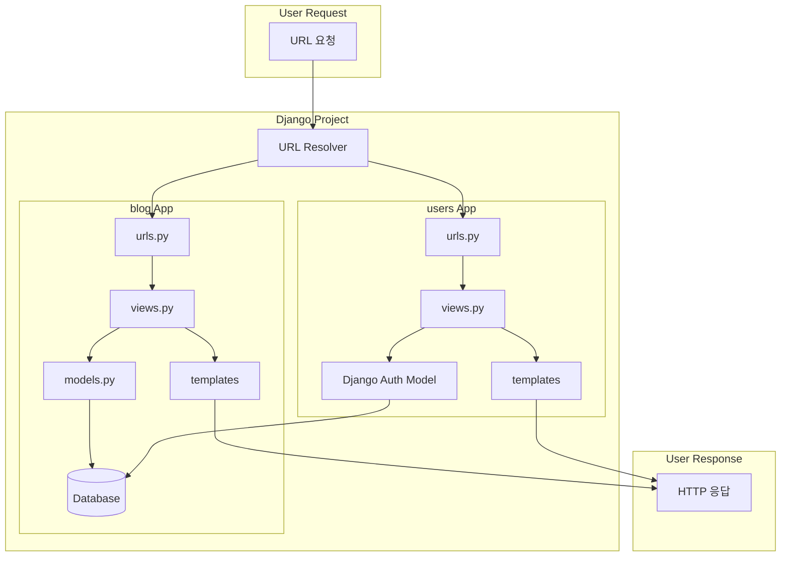
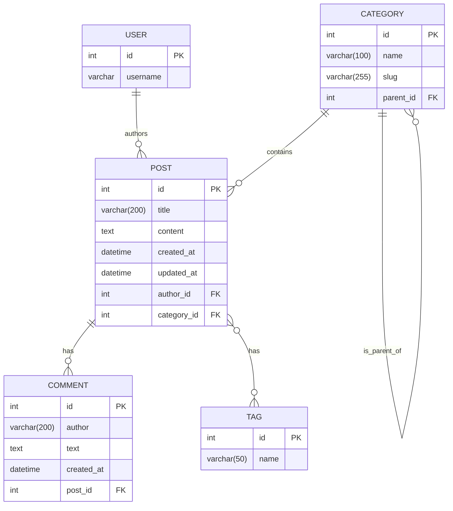

# System Patterns: Django TDD 블로그

## 1. 시스템 아키텍처 (System Architecture)

이 프로젝트는 Django 프레임워크의 기본 아키텍처인 **MVT (Model-View-Template)** 패턴과 **앱 분리 원칙(App Separation Principle)**을 따른다.

- **`blog` App**: 블로그의 핵심 기능인 게시글, 댓글, 카테고리, 태그 등 콘텐츠와 관련된 기능을 담당한다.
- **`users` App**: 사용자 인증(로그인, 로그아웃, 회원가입) 및 계정 관리 기능을 담당한다.
- 각 앱은 독립적인 Model, View, Template, URL, Form, Test 구조를 가진다.

## 2. 디자인 패턴 (Design Patterns)

- **TDD (Test-Driven Development)**: Red-Green-Refactor 사이클을 따른다.
    1.  **Red**: 실패하는 테스트 케이스를 작성한다.
    2.  **Green**: 테스트를 통과하는 최소한의 코드를 작성한다.
    3.  **Refactor**: 코드의 구조를 개선한다.
- **Fat Models, Thin Views**: 가능한 한 비즈니스 로직은 모델(Model)에 집중시키고, 뷰(View)는 모델과 템플릿을 연결하는 역할에 충실하도록 유지한다.
- **Class-Based Views (CBV)**: `ListView`, `DetailView`, `CreateView` 등 Django의 제네릭 클래스 기반 뷰를 적극적으로 활용하여 코드의 재사용성을 높이고 구조를 명확하게 한다.
- **URL 분리**: 프로젝트의 최상위 `urls.py`는 각 앱의 `urls.py`를 `include`하는 역할만 담당하여 URL 관리를 분산시킨다.

## 3. 컴포넌트 관계 (Component Relationships)



## 4. 데이터베이스 스키마 (Database Schema)

### 현재 스키마 (Current Schema)


### 목표 스키마 (Target Schema for New Features)
```mermaid
erDiagram
    USER {
        int id PK
        varchar username
    }

    POST {
        int id PK
        varchar(200) title
        text content
        int view_count
        datetime created_at
        datetime updated_at
        int author_id FK
        int category_id FK
    }

    COMMENT {
        int id PK
        text text
        datetime created_at
        int author_id FK
        int post_id FK
        int parent_id FK
    }

    CATEGORY {
        int id PK
        varchar(100) name
        varchar(255) slug
        int parent_id FK
    }

    TAG {
        int id PK
        varchar(50) name
    }

    VOTE {
        int id PK
        int value "1 for like, -1 for dislike"
        int user_id FK
        int post_id FK
    }

    USER ||--o{ POST : "authors"
    USER ||--o{ COMMENT : "authors"
    USER ||--o{ VOTE : "votes"

    POST ||--o{ COMMENT : "has"
    POST }o--o{ TAG : "tags"
    POST ||--o{ VOTE : "receives"

    CATEGORY ||--o{ POST : "contains"
    CATEGORY ||--o{ CATEGORY : "is_parent_of"

    COMMENT ||--o{ COMMENT : "is_reply_to"
